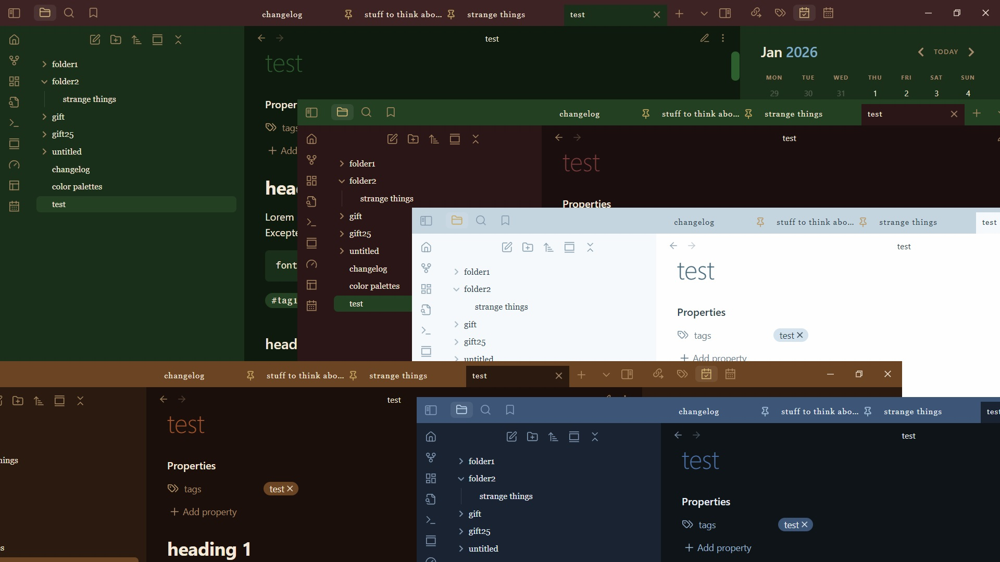

### Important:
My themes will now get published on [carrd](https://obsidian-theme-cafe.carrd.co)
 and can be downloaded directly as zip files.

# Jolly Holly

Since the old christmas theme is gone, there seems to be no festive theme in the gallery right now. This is what inspired me to make a theme fitting for christmas, yule, solstice or general winter aesthetic.

Of course you can use this at other times of the year too... 

#### Color schemes & modes

This theme is dark mode only (except Snowflake, which is light mode only). They work in both modes, with the header changing color slightly between light and dark. Callouts are always visible due to --callout-blend-mode: normal.

Color schemes you can choose from:
- Holly
- Berries
- Snowflake
- Cinnamon
- Winter Night

